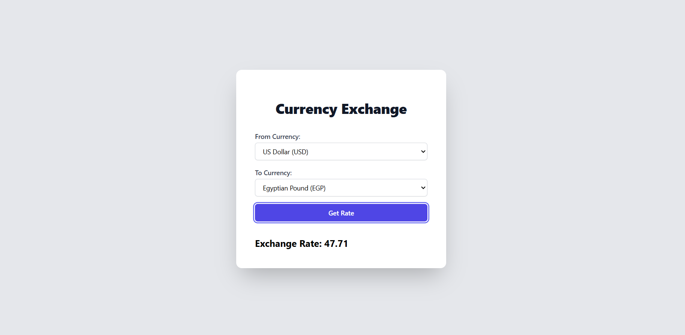

# Currency Exchange Rates App

Welcome to the Currency Exchange Rates App, your go-to solution for getting the latest currency exchange rates quickly and efficiently.



## Overview

This application integrates seamlessly with the Convert Currency to Multiple Currencies API, providing users with the ability to fetch exchange rates for specified "from" and "to" currencies. It boasts several robust features, including:

1. **High-Speed Caching**: Utilizes NodeCache for lightning-fast response times.
2. **Rate Limiting**: Protects the API from being overwhelmed by requests, ensuring stability and reliability.
3. **Dockerized Setup**: Easily deployable via Docker, with provided Dockerfile and Docker Compose configurations.
4. **Comprehensive Testing**: Rigorous unit tests implemented using Jest and PowerShell scripts to ensure the endpoint functions correctly under various conditions.
5. **Error Handling**: Robust error handling mechanisms to maintain the integrity and reliability of the application.

## Getting Started

Follow these steps to get the application up and running on your local machine:

1. **Clone the Repository**:

   ```bash
   git clone https://github.com/BasselAhmed02/currency-exchange-rates-app.git
   ```

   and change the directory:

   ```bash
   cd currency-exchange-rates-app/currency-exchange-api
   ```

2. **Install Dependencies**:

   ```bash
   npm install
   ```

3. **Start the Server**:

   ```bash
   npm start
   ```

   The server will start on the specified port (default: 3000).

4. **Experiment with the Endpoint**:

   In another terminal, you can use curl or the provided PowerShell script to test the endpoint:

   ```bash
   curl "http://localhost:3000/api/exchange-rate?from=USD&to=EUR"
   ```

## Docker

To run the application using Docker:

```bash
docker-compose up --build
```

The application will be available on Port 3000

## API Documentation

The application includes swagger documentation that can be accessed at:

http://localhost:3000/api-docs

Take care that the documentation endpoint is rate-limited as well 😉 (the rate limit provided in the project is 15 requests per minute)

## Testing

To run the jest test file:

```bash
npm test
```

## Front-End

For demonstration purposes, we have created a simple frontend to test our application. To get it running, follow these steps:

1. **Change Directory**:

   In another window, open the project folder and change directory to the frontend folder:

   ```bash
   cd currency-exchange-rates-app/currency-exchange-frontend
   ```

2. **Install Dependencies**:
   ```bash
   npm install
   ```
3. **Start the Server**:

   ```bash
   npm run dev
   ```

   Make sure that the Port running the frontend is Port 5173 as it is the one permitted by cors in the backend.
